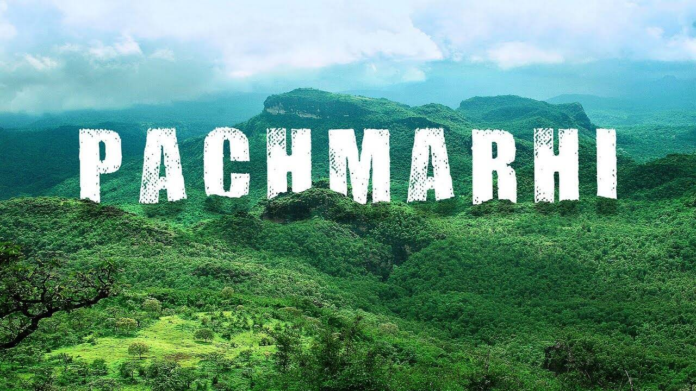

# 🏞️ Pachmarhi Tourist Guide

🎉 Welcome to the Pachmarhi Tourist Guide 🌐 website! This project is a visually 👀 appealing and informative 📖 guide to Pachmarhi, a charming 🏔️ hill station nestled 🏞️ in the Satpura Range 🗻 of Madhya Pradesh, India 🇮🇳. It showcases Pachmarhi's most popular ⭐ attractions and highlights its natural 🌳 beauty, historical 📜 significance, and cultural 🎭 richness.

## 🎯 Features

- **Responsive Design 📱:** Optimized for viewing 👓 on various devices 📱💻🖥️ and screen sizes.

- **Attractive Visuals 🌅:** Uses beautiful 🌸 background images 🖼️ for each section to enhance user 👤 experience.

- **Detailed Descriptions 📋:** Provides comprehensive 🧐 information ℹ️ about each attraction.

- **Easy Navigation 🧭:** Simplified layout 🗂️ to help users explore 🧳 the website seamlessly.

## 🏝️ Attractions Covered

**1. Jatashankar Temple 🕉️:** A serene 🕊️ cave 🕳️ temple dedicated to Lord Shiva 🙏.

**2. Satpura National Park 🐅:** A haven for wildlife 🦌 enthusiasts.

**3. Bee Falls 💦:** A stunning ✨ waterfall perfect 👍 for relaxation 🛀 and photography 📸.

**4. Chauragarh Peak 🗻:** A sacred ✝️ mountain 🏔️ with a challenging ⛰️ climb 🧗.

**5. Reechgarh 🦝:** A fascinating 🤔 cave 🕳️ with unique 🌟 rock formations.

**6. Bada Mahadeo Mandir 🛕:** A mystical 🌀 temple inside a cave 🕳️.

**7. Pandava Caves 🕉️:** Ancient 🏛️ caves with mythological 📜 significance.

**8. Bison Lodge Museum 🏛️:** A historical 🏺 museum showcasing Pachmarhi's biodiversity 🦜.

**9. Apsara Vihar 🧚:** A natural 🌊 pool 🏊‍♂️ known for its tranquil 😌 ambiance.

**10. Dhoopgarh 🌄:** The highest 🗻 point in Pachmarhi, offering stunning 🤩 sunrise 🌅 and sunset 🌇 views.

**11. Green Valley 🌳:** A scenic viewpoint 🌿 with panoramic 🌄 vistas of lush 🌳 forests.

## 💻 Technologies Used

- **HTML5 📝:** For structuring the content 🗂️.

- **CSS3 🎨:** For styling 💅 and enhancing visual 👀 appeal.

## 🔗 Project Link

**Access the project here:- https://arpanpatra111.github.io/Pachmarhi2025/** 

## 🚀 Future Enhancements

- Add interactive 🖱️ maps 🗺️ for each location 📍.

- Integrate a booking system 📅 for local tours 🚐.

- Include user 👤 reviews 📝 and ratings ⭐ for attractions 🏝️.

Explore 🧭 the beauty 🌄 of Pachmarhi through this guide 📖 and immerse 🤿 yourself in its natural 🌳 and cultural 🎭 wonders!

